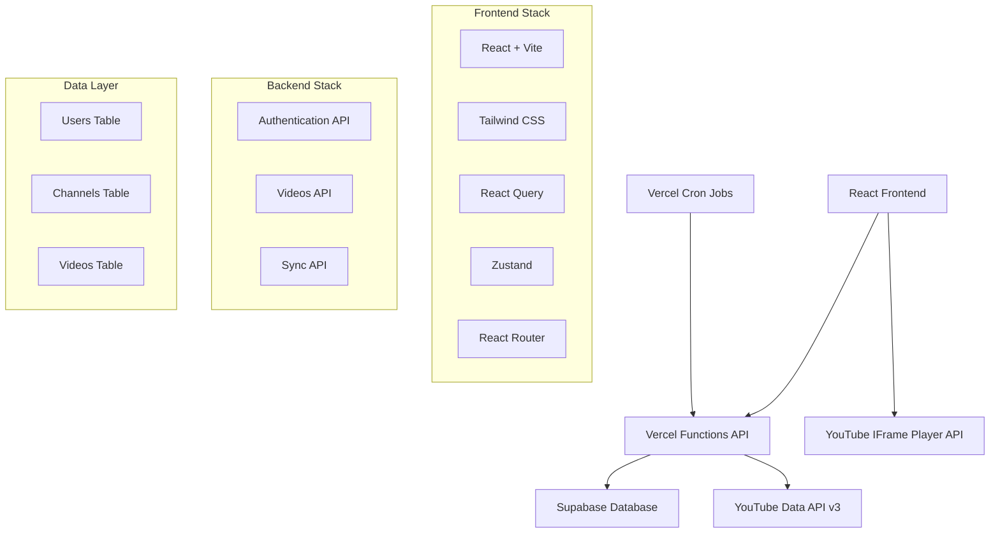

# Design Document

## Overview

The YouTube Subscription Manager is a modern web application built with React and serverless architecture. It provides a streamlined interface for managing YouTube video consumption through a personalized feed system. The application leverages Google OAuth for authentication, Supabase for data persistence, and Vercel Functions for serverless API endpoints.

## Architecture

### High-Level Architecture



### Technology Stack

**Frontend:**
- React 18 with Vite for fast development and building
- Tailwind CSS for utility-first styling
- React Query for server state management and caching
- Zustand for client-side state management
- React Router for navigation

**Backend:**
- Vercel Functions for serverless API endpoints
- Supabase for PostgreSQL database and authentication helpers
- YouTube Data API v3 for fetching subscription and video data

**Infrastructure:**
- Vercel for hosting and serverless functions
- Vercel Cron Jobs for automated video syncing
- Supabase for managed PostgreSQL database

## Components and Interfaces

### Frontend Components

#### Core Components

**VideoCard Component**
```typescript
interface VideoCardProps {
  video: {
    id: string;
    videoId: string;
    title: string;
    channelName: string;
    thumbnailUrl: string;
    publishedAt: string;
    duration: string;
  };
  onWatch: (videoId: string) => void;
  onSkip: (videoId: string) => void;
}
```

**VideoFeed Component**
```typescript
interface VideoFeedProps {
  videos: Video[];
  loading: boolean;
  error: string | null;
  onRefresh: () => void;
}
```

**VideoPlayer Component**
```typescript
interface VideoPlayerProps {
  videoId: string;
  onBack: () => void;
}
```

#### Page Components

**Home Page** - Main video feed with filtering and actions
**Watch Page** - Full-screen video player with navigation
**Login Page** - Google OAuth authentication flow

### API Interfaces

#### Authentication Endpoints

**POST /api/auth/google**
- Initiates Google OAuth flow
- Returns: `{ authUrl: string }`

**GET /api/auth/callback**
- Handles OAuth callback
- Returns: `{ accessToken: string, refreshToken: string, user: User }`

#### Video Management Endpoints

**GET /api/videos**
- Fetches user's current video feed
- Query params: `limit`, `offset`
- Returns: `{ videos: Video[], hasMore: boolean }`

**DELETE /api/videos/:videoId**
- Removes video from user's feed
- Returns: `{ success: boolean }`

#### Sync Endpoints

**POST /api/sync**
- Triggers video sync for user or all users (cron)
- Returns: `{ syncedVideos: number, errors: string[] }`

## Data Models

### Database Schema

#### Users Table
```sql
CREATE TABLE users (
  id UUID PRIMARY KEY DEFAULT gen_random_uuid(),
  google_id TEXT UNIQUE NOT NULL,
  email TEXT NOT NULL,
  access_token TEXT NOT NULL, -- Encrypted
  refresh_token TEXT NOT NULL, -- Encrypted
  last_sync TIMESTAMP WITH TIME ZONE,
  created_at TIMESTAMP WITH TIME ZONE DEFAULT NOW()
);
```

#### Channels Table
```sql
CREATE TABLE channels (
  id UUID PRIMARY KEY DEFAULT gen_random_uuid(),
  user_id UUID REFERENCES users(id) ON DELETE CASCADE,
  channel_id TEXT NOT NULL, -- YouTube channel ID
  channel_name TEXT NOT NULL,
  thumbnail_url TEXT,
  created_at TIMESTAMP WITH TIME ZONE DEFAULT NOW(),
  UNIQUE(user_id, channel_id)
);
```

#### Videos Table
```sql
CREATE TABLE videos (
  id UUID PRIMARY KEY DEFAULT gen_random_uuid(),
  user_id UUID REFERENCES users(id) ON DELETE CASCADE,
  video_id TEXT NOT NULL, -- YouTube video ID
  channel_id TEXT NOT NULL,
  channel_name TEXT NOT NULL,
  title TEXT NOT NULL,
  thumbnail_url TEXT,
  published_at TIMESTAMP WITH TIME ZONE NOT NULL,
  duration TEXT,
  created_at TIMESTAMP WITH TIME ZONE DEFAULT NOW(),
  UNIQUE(user_id, video_id)
);

CREATE INDEX idx_videos_user_published ON videos(user_id, published_at DESC);
```

### TypeScript Interfaces

```typescript
interface User {
  id: string;
  googleId: string;
  email: string;
  lastSync?: Date;
}

interface Channel {
  id: string;
  userId: string;
  channelId: string;
  channelName: string;
  thumbnailUrl?: string;
}

interface Video {
  id: string;
  userId: string;
  videoId: string;
  channelId: string;
  channelName: string;
  title: string;
  thumbnailUrl?: string;
  publishedAt: Date;
  duration?: string;
}
```

## Error Handling

### Frontend Error Handling

**Network Errors**
- React Query automatically handles retries and error states
- Display user-friendly error messages with retry options
- Implement exponential backoff for failed requests

**Authentication Errors**
- Automatic token refresh using refresh tokens
- Redirect to login on authentication failure
- Clear stored tokens on persistent auth errors

**UI Error Boundaries**
- Implement React Error Boundaries for component-level error handling
- Graceful degradation when components fail
- Error reporting for debugging

### Backend Error Handling

**YouTube API Errors**
- Handle quota exceeded errors with appropriate user messaging
- Implement retry logic with exponential backoff
- Log API errors for monitoring and debugging

**Database Errors**
- Transaction rollback on failed operations
- Connection pooling and retry logic
- Graceful handling of constraint violations

**Authentication Errors**
- Secure token validation and refresh
- Handle expired or invalid tokens
- Rate limiting for authentication endpoints

## Testing Strategy

### Frontend Testing

**Unit Tests**
- Component testing with React Testing Library
- Hook testing for custom React hooks
- Utility function testing

**Integration Tests**
- API integration testing with MSW (Mock Service Worker)
- User flow testing with Playwright or Cypress
- Authentication flow testing

### Backend Testing

**API Testing**
- Endpoint testing with supertest or similar
- Authentication middleware testing
- Database operation testing

**Integration Testing**
- YouTube API integration testing with mocked responses
- Database integration testing with test database
- Cron job testing with scheduled execution simulation

### Performance Considerations

**Frontend Optimization**
- React Query caching for reduced API calls
- Virtual scrolling for large video lists
- Image lazy loading for thumbnails
- Code splitting for route-based chunks

**Backend Optimization**
- Database indexing for efficient queries
- Connection pooling for database connections
- Caching strategies for frequently accessed data
- YouTube API quota management and optimization

**Sync Strategy Optimization**
- Batch processing for multiple channel syncs
- Incremental sync using `publishedAfter` parameter
- Error handling and retry logic for failed syncs
- Quota-aware sync scheduling

## Security Considerations

**Authentication Security**
- Secure token storage with encryption
- HTTPS-only cookie settings
- CSRF protection for state-changing operations
- Secure OAuth implementation following best practices

**Data Protection**
- Input validation and sanitization
- SQL injection prevention with parameterized queries
- Rate limiting for API endpoints
- Secure environment variable management

**API Security**
- YouTube API key protection
- Request validation and authorization
- Error message sanitization to prevent information leakage
- Audit logging for security events

## Deployment and Infrastructure

**Vercel Configuration**
```json
{
  "functions": {
    "api/**/*.js": {
      "maxDuration": 30
    }
  },
  "crons": [{
    "path": "/api/sync",
    "schedule": "0 */3 * * *"
  }]
}
```

**Environment Variables**
- `VITE_YOUTUBE_CLIENT_ID` - Google OAuth client ID
- `YOUTUBE_CLIENT_SECRET` - Google OAuth client secret
- `VITE_SUPABASE_URL` - Supabase project URL
- `VITE_SUPABASE_ANON_KEY` - Supabase anonymous key
- `SUPABASE_SERVICE_KEY` - Supabase service role key
- `ENCRYPTION_KEY` - Key for encrypting stored tokens

**Database Migration Strategy**
- Version-controlled migration files
- Automated migration deployment
- Rollback procedures for failed migrations
- Data backup before major schema changes